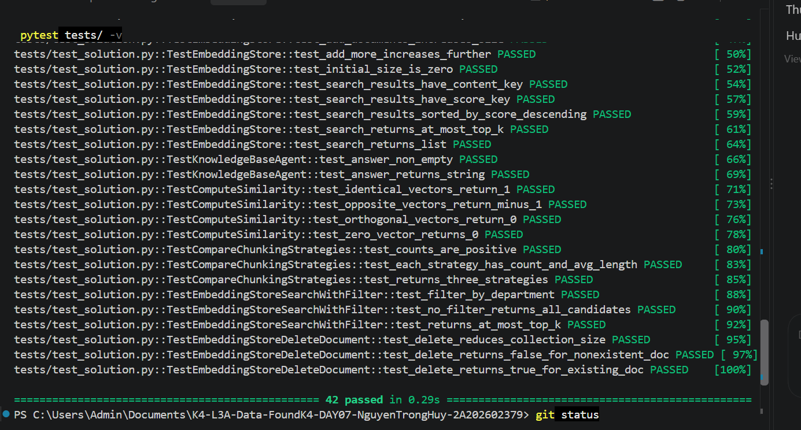

# Báo Cáo Cá Nhân - Lab 7: Embedding & Vector Store

**Họ tên:** Nguyễn Trọng Huy
**Nhóm:** TODO - chờ nhóm thống nhất thông tin
**Ngày:** 2026-09-19

> **Phạm vi đã làm:** hoàn thành phần cá nhân CP3/CP4 và nhiệm vụ R3 khi corpus/benchmark chung đã được cung cấp. Các phần so sánh đầy đủ với R1/R2 vẫn để TODO vì cần kết quả từ các thành viên đó.

**Tổng điểm phần cá nhân: 60** = Khởi động (5) + Hướng tiếp cận (10) + Hoàn thiện code (30) + Dự đoán độ tương tự (5) + Kết quả truy xuất của tôi (10).

---

## 1. Khởi động (Warm-up) - Cá nhân (5 điểm)

### Độ tương tự Cosine (Cosine Similarity) (Bài tập 1.1)

**Độ tương tự cosine cao nghĩa là gì?**
Hai đoạn văn bản có cosine similarity cao nghĩa là vector embedding của chúng gần cùng hướng, tức là chúng có nội dung hoặc ý nghĩa gần nhau trong không gian biểu diễn. Điểm cao không nhất thiết đòi hỏi hai câu dùng đúng cùng từ, mà thường cho thấy chúng nói về cùng chủ đề hoặc cùng ý định.

**Ví dụ có độ tương tự cao:**
- Câu A: Sinh viên cần đăng ký học phần trước hạn.
- Câu B: Người học phải hoàn tất việc ghi danh môn học đúng thời gian quy định.
- Lý do: hai câu dùng từ khác nhau nhưng cùng nói về việc đăng ký học phần đúng hạn.

**Ví dụ có độ tương tự thấp:**
- Câu A: Học bổng được xét dựa trên điểm trung bình.
- Câu B: Máy chủ cần sao lưu dữ liệu mỗi đêm.
- Lý do: hai câu thuộc hai chủ đề khác nhau.

**Tại sao cosine similarity được ưu tiên hơn Euclidean distance cho text embeddings?**
Cosine similarity tập trung vào hướng của vector, nên phù hợp để so ý nghĩa khi độ dài hoặc cường độ vector khác nhau. Với text embeddings, hai câu cùng nghĩa có thể có độ lớn vector khác nhau, vì vậy so hướng thường ổn định hơn so khoảng cách tuyệt đối.

### Bài toán tính toán Chunking (Bài tập 1.2)

**Tài liệu 10,000 ký tự, `chunk_size=500`, `overlap=50`. Bao nhiêu chunks?**
Công thức: `ceil((10000 - 50) / (500 - 50)) = ceil(9950 / 450) = 23`. Kiểm tra bằng `FixedSizeChunker(chunk_size=500, overlap=50)` cũng cho ra **23 chunks**.

**Nếu overlap tăng lên 100, số chunk thay đổi thế nào?**
Khi `overlap=100`, công thức là `ceil((10000 - 100) / (500 - 100)) = ceil(9900 / 400) = 25`, tức là số chunk tăng từ 23 lên 25. Overlap lớn hơn giúp giữ ngữ cảnh ở ranh giới giữa hai chunk, nhưng tạo nhiều chunk hơn và tốn thêm chi phí lưu trữ/tìm kiếm.

---

## 2. Hướng tiếp cận của tôi (My Approach) - Cá nhân (10 điểm)

### CP3 - Chunking

**`SentenceChunker.chunk`:** dùng regex lookbehind `(?<=[.!?])\s+` để tách tại khoảng trắng sau dấu kết câu, nhờ đó dấu `.`, `!`, `?` vẫn được giữ trong câu. Text rỗng hoặc chỉ có khoảng trắng trả về `[]`; các câu sau khi tách được gom theo `max_sentences_per_chunk`.

**`RecursiveChunker.chunk` / `_split`:** tách đệ quy theo thứ tự separator `["\n\n", "\n", ". ", " ", ""]`, ưu tiên ranh giới lớn trước để giữ ngữ nghĩa. Nếu một mảnh vẫn dài hơn `chunk_size`, `_split` tiếp tục dùng separator nhỏ hơn; khi hết separator hoặc gặp separator rỗng thì fallback bằng cách cắt cứng theo `chunk_size`. Sau khi split, `chunk()` merge các mảnh nhỏ liền kề để tránh tạo quá nhiều chunk vụn.

**`compute_similarity`:** tính cosine similarity và trả `0.0` nếu một trong hai vector có độ lớn bằng 0 để tránh chia cho 0.

**`ChunkingStrategyComparator.compare`:** trả đúng ba chiến lược `fixed_size`, `by_sentences`, `recursive`, mỗi chiến lược có `count`, `avg_length`, `chunks`; text rỗng không gây chia cho 0.

### CP4 - Store và Agent

**`EmbeddingStore`:** dùng in-memory store, mỗi `Document` được chuẩn hóa thành record gồm `id`, `content`, bản copy `metadata`, `embedding`, và `index`. `_make_record()` bảo đảm `metadata["doc_id"]` tồn tại để `delete_document()` xóa đúng mọi chunk thuộc cùng tài liệu.

**`search` / `search_with_filter`:** dùng chung helper tìm kiếm. `search_with_filter()` lọc metadata trước, sau đó mới similarity search trên tập ứng viên hợp lệ.

**`delete_document`:** xóa tất cả record có `metadata["doc_id"] == doc_id`, trả `True` nếu thật sự xóa được và `False` nếu không có gì để xóa.

**`KnowledgeBaseAgent.answer`:** lấy top-k context từ store, đánh số context `[1]`, `[2]`, `[3]`, kèm nguồn/file/doc_id để trace nguồn. Prompt yêu cầu model chỉ trả lời dựa trên context và nói rõ không tìm thấy nếu context không đủ thông tin. Store rỗng được xử lý an toàn.

### R3 - Strategy & Architecture

**`HeadingSectionChunker`:** chunk theo heading Markdown và giữ heading cha trong từng chunk. Nếu section quá dài, phần body được chia nhỏ bằng `RecursiveChunker`, sau đó prefix heading được gắn lại vào từng chunk con.

Lý do chọn: corpus thư viện là dạng quy định/quy trình, nhiều heading chứa phạm vi áp dụng. Giữ heading cha giúp chunk ngắn vẫn mang đủ bối cảnh khi retrieval trả về một dòng hoặc một đoạn nhỏ.

---

## 3. Hoàn thiện code (Core Implementation) - Cá nhân (30 điểm)

### Kết Quả Kiểm Thử

```text
Command: pytest tests/ -k "Chunker or Similarity or Compare" -v
Result: 23 passed, 19 deselected

Command: pytest tests/ -v
Collected: 42 items
Result: 42 passed
```

**Số lượng bài test vượt qua:** 42 / 42


**Ghi chú chạy `main.py`:** chạy với `PYTHONIOENCODING=utf-8` để tránh lỗi stdout tiếng Việt trên PowerShell/Windows.

---

## 4. Dự đoán độ tương tự (Similarity Predictions) - Cá nhân (5 điểm)

> Các điểm thực tế dưới đây dùng `_mock_embed`, nên chỉ phục vụ kiểm tra hàm `compute_similarity`; mock embedder không phản ánh ngữ nghĩa thật của tiếng Việt.

| Cặp | Câu A | Câu B | Dự đoán | Điểm thực tế | Đúng? |
|------|-----------|-----------|---------|--------------|-------|
| 1 | Sinh viên cần đăng ký học phần trước hạn. | Người học phải hoàn tất việc ghi danh môn học đúng thời gian quy định. | cao | 0.094 | Không rõ - mock không theo ngữ nghĩa |
| 2 | Thư viện mở cửa đến 20 giờ vào ngày thường. | Sinh viên có thể mượn sách tại thư viện trong giờ phục vụ. | cao | 0.084 | Không rõ - mock không theo ngữ nghĩa |
| 3 | Học bổng được xét dựa trên điểm trung bình. | Máy chủ cần sao lưu dữ liệu mỗi đêm. | thấp | 0.079 | Không rõ - mock không theo ngữ nghĩa |
| 4 | Python là ngôn ngữ lập trình bậc cao. | Học phí phải được thanh toán trước hạn quy định. | thấp | -0.132 | Phù hợp |
| 5 | Chunking chia tài liệu dài thành các đoạn nhỏ. | Vector store lưu embedding để tìm kiếm tương tự. | trung bình | -0.027 | Không rõ - mock không theo ngữ nghĩa |

**Kết quả nào bất ngờ nhất?**
Cặp 1 và 2 được dự đoán cao về mặt ngữ nghĩa nhưng điểm mock chỉ gần 0, trong khi cặp 3 khác chủ đề cũng gần tương tự. Điều này cho thấy mock embedder chỉ hữu ích để test cấu trúc và luồng dữ liệu; muốn đánh giá ý nghĩa thật cần embedder ngữ nghĩa như local multilingual, OpenAI hoặc Gemini.

---

## 5. Kết quả truy xuất của tôi (Competition Results) - Cá nhân (10 điểm)

Benchmark cá nhân R3 chạy bằng `HeadingSectionChunker(max_chunk_size=500)` trên corpus thật trong `data/thu-vien`, dùng đúng 5 query/gold answer chung từ `bench.py`. Embedder hiện tại là `mock embeddings fallback`, nên điểm số có nhiễu và không phản ánh đầy đủ ngữ nghĩa tiếng Việt.

| # | Câu hỏi (Query) | Top-1 Chunk truy xuất được (tóm tắt) | Điểm Score | Có liên quan không? | Câu trả lời của Agent (tóm tắt) |
|---|-------|--------------------------------|-------|-----------|------------------------|
| 1 | Ở Thư viện Đại học Ngoại thương được mượn về nhà tối đa bao nhiêu tài liệu và trong bao lâu? | `library-similarity-check#11`, nội dung Turnitin/chính sách tra soát, không phải quy định mượn của người học | 0.234 | Không; top-3 không có chunk chứa đáp án | Benchmark không gọi agent; context top-3 không đủ để trả lời |
| 2 | Chỉ số trùng lặp tối đa cho khóa luận tốt nghiệp khi tra soát trên Turnitin là bao nhiêu? | `ftu-library-borrowing-faculty#2`, nội dung mượn tài liệu của cán bộ/giảng viên | 0.165 | Không; gold doc ở hạng 2 nhưng không chứa needle | Benchmark không gọi agent; context top-3 chưa có đáp án |
| 3 | Sau khi người học nộp biên bản tra soát, thư viện trả kết quả trong bao lâu và ở đâu? | `library-similarity-check#2`, đúng tài liệu nhưng chưa phải chunk chứa đáp án | 0.299 | Có trong top-3; chunk đáp án ở hạng 3 | Top-3 có thể trả lời: tại K214, chậm nhất trong 02 ngày làm việc kể từ ngày nộp biên bản |
| 4 | Thư viện Học viện Ngoại giao mở cửa vào Thứ Bảy từ mấy giờ đến mấy giờ? | `ftu-library-general-regulations#5`, quy định sử dụng dịch vụ/trang thiết bị FTU | 0.205 | Không; top-3 không có chunk chứa đáp án | Benchmark không gọi agent; context top-3 không đủ để trả lời |
| 5 | Mượn tài liệu về nhà trả trễ hạn bao nhiêu lần trong một năm học thì bị coi là hành vi nghiêm cấm? | `dav-library-rules#5`, nội quy DAV, không phải quy định chung FTU chứa điều kiện vi phạm | 0.437 | Không; top-3 không có chunk chứa đáp án | Benchmark không gọi agent; context top-3 không đủ để trả lời |

**Bao nhiêu câu hỏi trả về chunk có liên quan trong top-3?** 1 / 5

**Điểm benchmark R3:** Mức 1 theo doc_id = 3/10; Mức 2 theo chunk chứa đáp án = 1/10.

**Nhận xét:** `HeadingSectionChunker` giữ ngữ cảnh heading tốt và phù hợp cấu trúc Markdown của corpus. Tuy nhiên, với MockEmbedder, retrieval vẫn nhiễu: nhiều câu lấy sai tài liệu, hoặc lấy đúng tài liệu nhưng chưa đúng chunk chứa đáp án. Kết quả này nên được xem là kiểm tra pipeline/chunking, không phải đánh giá ngữ nghĩa cuối cùng.

**Điều hay nhất tôi học được từ thành viên khác / nhóm khác (qua demo):**
TODO - chờ demo và phần so sánh nhóm sau khi R1/R2 gửi kết quả.

---

## Tự Đánh Giá (Phần Cá Nhân)

| Tiêu chí | Điểm tự đánh giá |
|----------|-------------------|
| Khởi động (Warm-up) | 5 / 5 |
| Hướng tiếp cận của tôi (My Approach) | 10 / 10 |
| Hoàn thiện code (Core Implementation - tests) | 30 / 30 |
| Dự đoán độ tương tự (Similarity Predictions) | 5 / 5 |
| Kết quả truy xuất của tôi (Competition Results) | 1 / 10 theo benchmark R3 hiện tại |
| **Tổng phần cá nhân** | **51 / 60 hiện tại; phần retrieval cần so sánh lại khi R1/R2 có kết quả và/hoặc dùng embedding ngữ nghĩa thật** |

